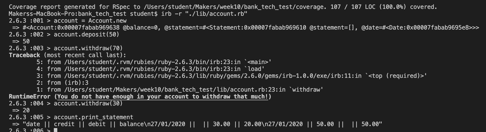

# Bank Tech Test

-Describe how to install dependencies, run tests and run the project
-Decribe your approach
-Describe how you structured your code and why
-screenshot of your running app

## Description

An app to mimick the system of an account in a bank. Features include:

- User can deposit into account
- User can withdraw from an account
- User can print a statement of all their deposits and withdrawals
- Statement contains the date of the transaction, the transaction and the account balance
- User cannot withdraw more than the balance in the account

## Approach

I started out by analysing the specifications and creating a table of classes and associated methods:

Account | Statement | Date
------- | --------- | ----
.deposit | .create_credit | .today
.withdraw | .create_debit |
.print_statement | .show |

Using this as a starting point, I then began to create the app using test driven development and the red, green, refactor cycle . I began by creating tests for the most important features first and dealt with edge cases, such as not being  
able to withdraw more than your balance, last.

## How I structured my code

My code is split up into three classes; Account, Statement and Date.

## App in use



## How to Install
INSERT LINK TO CLONE

```
$ git clone 
$ bundle install
```

## How to run tests

From terminal run `rspec`

## How to run the project

From terminal run `irb -r "./path/to/account.rb"`


